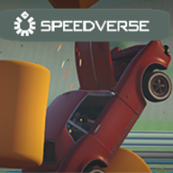

# SpeedVerse

**SpeedVerse** is where high-speed racing meets the thrill of the unknown. With a universe of racing experiences, from Formula circuits to offroad racing, and now with the integration of a Static Mesh Replacement System for Vehicle Skeleton models, SpeedVerse promises both realism and innovation in racing.

## 📌 Index  
- [Overview](#overview)  
- [Racing Modes](#racing-modes)  
- [Locations](#locations)  
- [Upcoming Features](#upcoming-features)  
- [Development Notes](#development-notes)  
- [License and Legal](#license-and-legal)
- [Links and Resources](#links-and-resources)

## Overview

SpeedVerse reimagines racing with:

- **Diverse Racing Experiences:** From the precision of Formula racing to the chaos of rocket cars, and beyond.
- **Static Mesh for Vehicles:** Revolutionizing how cars are rendered, replacing traditional skeletal meshes for better performance.
- **Dynamic Environments:** Experience real-world circuits, whimsical tracks, and open-world exploration through multiverse portals.
- **Vehicle Variety:** Starting with Formula cars, expanding to include rocket cars, bikes, and more.

## Racing Modes

### Traditional Simcade
- **XRS:** All new Onroad/Offroad Racing Mode being developed.
- **Formula Series:** The classic racing experience with precision handling.
- **Base Tracks:** Compete on iconic circuits like Monza, Brazil, and more.

### Special Events
- **Portal Jumps:** Utilize level sublevel streaming for seamless transitions between tracks, even mid-air.

### Custom and Thematic Challenges
- **Underwater:** Unique aquatic racing environments.
- **Holiday Themed:** Seasonal races with festive twists.
- **UGC/DLC:** Expand your racing library with user-generated content or downloadable expansions.

### Convergence and Open Worlds
- **Derby/Destruction:** A focus on tactical demolition.
- **Bomb Squad:** Races with a twist of danger.
- **Open Worlds:** Explore and race across vast, interconnected worlds.

## Locations

- **Monza, Brazil, Diriyah, Montreal, Nürburgring Nordschleife, Spa, Santiago, Singapore, Qatar:** Each track brings its own set of challenges and stunning visuals.

## Upcoming Features

- **Expanded Fleet:** More vehicle types including bikes and unique concept vehicles.
- **New Worlds:** Further exploration into the multiverse with new, mysterious racing environments.
- **Deeper Customization:** More options for vehicle tuning and personalization.

## Development Notes

- **Static Mesh Utilization:** A key feature for vehicle models, enhancing visual quality while optimizing performance by eliminating the need for complex skeletal animations.
- **Seamless Transitions:** Achieved through level sublevel streaming and widget integration, ensuring players can move from one racing scenario to another without breaking immersion.
- **Unity Integration:** This project uses Unity 6 with the NWheel Vehicle Physics system for realistic vehicle dynamics and handling.

## License and Legal

### ⚠️ Important: Source Available (NOT Open Source)

This project is **SOURCE AVAILABLE** (also known as "source peekable"), meaning the source code is visible for inspection and educational purposes. However, **this is NOT open-source software**.

**Key Points:**
- ✅ You can **view** and **inspect** the source code
- ❌ You **CANNOT** freely modify, distribute, or create derivative works
- ❌ All modifications require explicit authorization from the Licensor
- ❌ This is proprietary software with source visibility

### Distribution Status

**Whether this Software will be sold commercially or provided free of charge is UNDETERMINED and remains at the sole discretion of the proprietor.** This decision will be made at a future date.

### Legal Documents

Please review the following documents:
- **[LICENSE](LICENSE)** - Source Available License (NOT open source) - located in project root
- **[docs/EULA.md](docs/EULA.md)** - End-User License Agreement
- **[docs/NOTICE.md](docs/NOTICE.md)** - Attribution and Third-Party Components
- **[docs/CHANGELOG.md](docs/CHANGELOG.md)** - Changelog & Build Plan

**Important:** You may not modify, distribute, or create derivative works of this Software without explicit prior authorization from the Licensor under NDA. Only those explicitly authorized by the Licensor are permitted to make such modifications.

## Links and Resources

### Official Links
- **Website (WIP):** [https://gamedev44.github.io/Speedverse.com/](https://gamedev44.github.io/Speedverse.com/)
- **GitHub Repository:** [https://github.com/gamedev44/SpeedVerseInvision](https://github.com/gamedev44/SpeedVerseInvision)

### Contact
- **Indie Unlimited / Iron Will Interactive (IWI)**
- Phone: [+1 (405) 706-6557]

### Documentation
- For detailed documentation and tutorials, visit our [GitHub repository](https://github.com/gamedev44/SpeedVerseInvision)
- Check out the modding tutorial playlist for development guides

---

## SpeedVerse PhysCore

This Unity project represents the core physics engine for SpeedVerse, built on the NWheel Vehicle Physics system. The project has been rebranded and customized for SpeedVerse's unique racing experience.

### Project Structure

- **Assets/NWheel/** - Vehicle physics system (formerly NWH)
- **Assets/SpeedVerse/** - SpeedVerse-specific implementations
- Core vehicle physics, input systems, and racing mechanics

### Development Status

**⚠️ This project is currently in active development and is not ready for public release.**

**⚠️ Source Available - NOT Open Source: This software is provided with source code visibility for transparency and educational purposes only. All restrictions apply.**

---

**Copyright [2025] [Indie Unlimited / Iron Will Interactive (IWI)] - All Rights Reserved**

This software is **SOURCE AVAILABLE** (not open source). See the [LICENSE](LICENSE) file for complete terms and restrictions.
