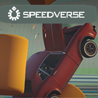

<!--Readme-->
# Speedverse


**Speedverse** is where high-speed racing meets the thrill of the unknown. With a universe of racing experiences, from Formula circuits to rocket car mayhem, and now with the integration of a Static Mesh Replacement System for Vehicle Skeleton models, Speedverse promises both realism and innovation in racing.

## 📌 Index  
- [Overview](#overview)  
- [Racing Modes](#racing-modes)  
- [Locations](#locations)  
- [Upcoming Features](#upcoming-features)  
- [Development Notes](#development-notes)  
- [Modding SpeedVerse](#modding-speedverse-renovated-sdk-framework)  

## Overview

Speedverse reimagines racing with:

- **Diverse Racing Experiences:** From the precision of Formula racing to the chaos of rocket cars, and beyond.
- **Static Mesh for Vehicles:** Revolutionizing how cars are rendered, replacing traditional skeletal meshes for better performance.
- **Dynamic Environments:** Experience real-world circuits, whimsical tracks, and open-world exploration through multiverse portals.
- **Vehicle Variety:** Starting with Formula cars, expanding to include rocket cars, bikes, and more.

## Racing Modes

### Traditional Simcade
- **Formula Series:** The classic racing experience with precision handling.
- **Base Tracks:** Compete on iconic circuits like Monza, Brazil, and more.

### Special Events
- **Rocket Cars:** High-speed, gravity-defying races.
- **Portal Jumps:** Utilize level sublevel streaming for seamless transitions between tracks, even mid-air.

### Custom and Thematic Challenges
- **Underwater:** Unique aquatic racing environments.
- **Holiday Themed:** Seasonal races with festive twists.
- **UGC/DLC:** Expand your racing library with user-generated content or downloadable expansions.

### Convergence and Open Worlds
- **Derby/Destruction:** A focus on tactical demolition.
- **Bomb Squad:** Races with a twist of danger.
- **Open Worlds:** Explore and race across vast, interconnected worlds.

## Locations

- **Monza, Brazil, Diriyah, Montreal, Nürburgring Nordschleife, Spa, Santiago, Singapore, Qatar:** Each track brings its own set of challenges and stunning visuals.

## Upcoming Features

- **Expanded Fleet:** More vehicle types including bikes and unique concept vehicles.
- **New Worlds:** Further exploration into the multiverse with new, mysterious racing environments.
- **Deeper Customization:** More options for vehicle tuning and personalization.

## Development Notes

- **Static Mesh Utilization:** A key feature for vehicle models, enhancing visual quality while optimizing performance by eliminating the need for complex skeletal animations.
- **Seamless Transitions:** Achieved through level sublevel streaming and widget integration, ensuring players can move from one racing scenario to another without breaking immersion.

## Modding SpeedVerse: Renovated SDK Framework  

SpeedVerse supports modding through its Renovated SDK Framework, allowing developers to extend and customize the game.  

### 🔧 Getting Started  
1. **Download the SDK** – Clone the repository:  
   ```sh
   git clone https://github.com/gamedev44/SpeedVerseInvision.git
   ```  
2. **Set Up Your Environment** – Ensure you have the necessary tools installed:  
   - Blender (or equivalent)  
   - Unreal Engine 5.3.2  
   - Substance Painter (or equivalent)  
   - TerraSculptor  
3. **Follow the Tutorials** – Check out the official modding tutorial playlist:  
   [](https://www.youtube.com/playlist?list=PL85wXcWAp0HUHSkywXlGlQfz9pl-zypzS)  

### 📁 Modding Features  
- 🔹 Custom assets, vehicles, maps, and game modes  
- 🔹 Full Blueprint access for scripting and extending functionality  
- 🔹 Full support for community-created plugins (as long as they are free to use)  

### 🚀 Join the Community  
Get involved in modding discussions, share your work, and collaborate with others!
[Join our Discord](https://discord.gg/yQtTSc8f84)


<!--
## Community Engagement

- **Feedback Loop:** Your input directly influences game development.
- **Update Frequency:** Regular content drops and feature updates.


## How to Start

- **Available On:** [PC via Steam](#), with plans for broader platform support.
- **Try the Demo:** Available at our [official website](#).
- **System Requirements:**
  - **Minimum:** Windows 10, Intel i5-4460 or AMD FX-8350, 8GB RAM, NVIDIA GTX 970 or AMD R9 290.
  - **Recommended:** Windows 11, Intel i7-7700 or AMD Ryzen 5 1600, 16GB RAM, NVIDIA GTX 1070 or AMD RX Vega 56.
  

Join the Speedverse community and experience racing in ways you've never imagined. Buckle up for a journey through time, space, and speed!
-->

